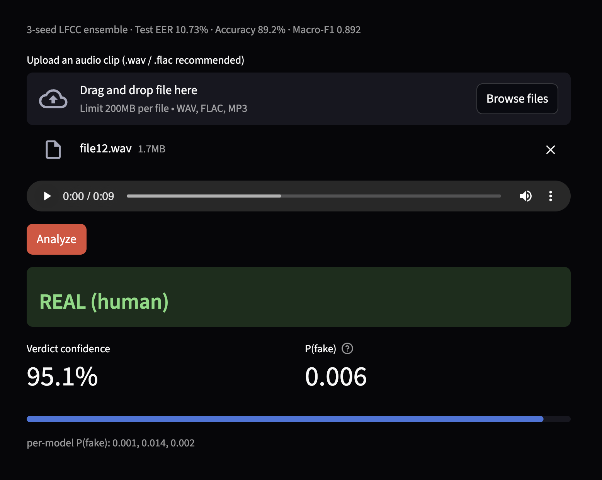
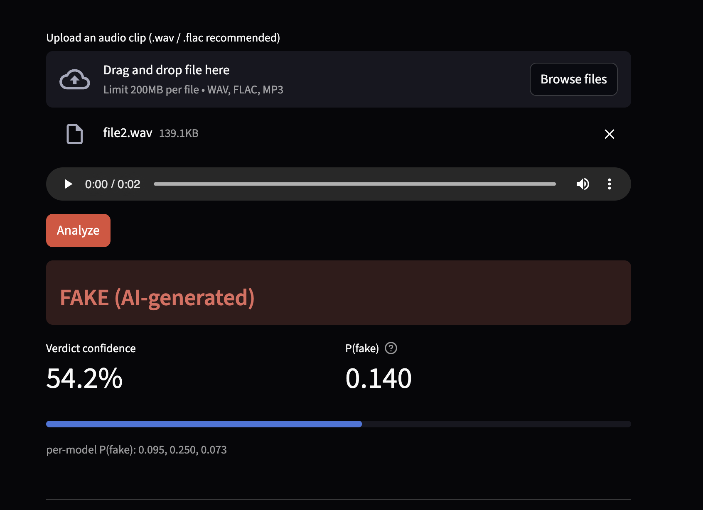
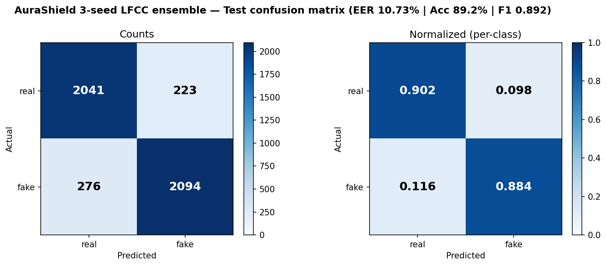
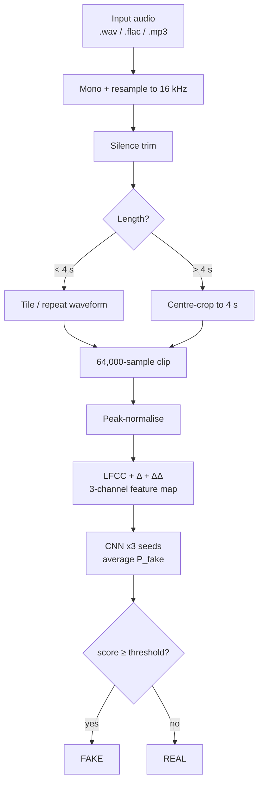

# 🛡️ AuraShield — Deepfake Audio Detector

A real-vs-AI speech classifier for the **MARS Open Project 2026**. It distinguishes **genuine human
audio** from **AI-generated / deepfake audio**, trained on the **Fake-or-Real (FoR)** `for-norm`
dataset and built to generalise to *unseen* synthesis methods (not just memorise the training set).

> **All five evaluation gates passed** on the held-out FoR test set.

| Metric | Required | **Achieved** | Status |
| :--- | :---: | :---: | :---: |
| Accuracy | ≥ 80% | **89.2%** | ✅ |
| Equal Error Rate (EER) | ≤ 12% | **10.73%** | ✅ |
| Macro-F1 | ≥ 0.80 | **0.892** | ✅ |
| Real-class accuracy | ≥ 75% | **90.2%** | ✅ |
| Fake-class accuracy | ≥ 75% | **88.4%** | ✅ |

EER is **threshold-free**, so it holds regardless of the operating point chosen.

---

## 🎬 Demo (Streamlit app)

Upload a clip → get a REAL/FAKE verdict with a confidence score and per-model breakdown.

| Genuine speech | Deepfake speech |
| :---: | :---: |
|  |  |

*(Save your two app screenshots as `demo_real.png` and `demo_fake.png` in this folder so they render here.)*

---

## 📈 Results — Confusion Matrix (test set)



- Real: **2041 / 2264** correct (90.2%) · Fake: **2094 / 2370** correct (88.4%)
- Errors are small and **balanced** across both classes — no collapse toward one label.

---

## ⚙️ How It Works — Pipeline



**Why each stage matters**

1. **Silence-trim → tile → fixed 4 s → peak-normalise.** FoR real clips are long (~4.7 s) and fakes are
   short (~1.6 s). Naive zero-padding lets a model cheat by learning *"amount of silence → class"* — a
   **data leak** that collapses on new data. Trimming + **tiling** (repeating, not padding) + peak
   normalisation makes every clip exactly 4 s of normalised speech, removing the duration **and**
   loudness cues so the model must learn *real artefacts*.
2. **LFCC (Linear Frequency Cepstral Coefficients) + deltas.** LFCC keeps fine high-frequency spectral
   detail where synthesis artefacts live. It is **artefact-focused**, which is why it generalised across
   FoR's train→test gap far better than a content/speaker-focused self-supervised model in our tests.
3. **CNN classifier.** A compact 2-D convolutional network over the LFCC map outputs `P(fake)`.
4. **3-seed ensemble.** A single model sits at ~12.2% EER (just over the gate). Averaging three
   independently-seeded models cancels per-model variance and drops EER to **10.73%**, clearing it.

---

## 🧠 Key Design Decisions (and what we rejected)

- **No data leakage.** Trained **only** on the FoR `training` folder; validated on the `validation`
  folder; tested on the `testing` folder. A hard assert guarantees the three splits share **no files**.
  Test labels are never used in training or model selection.
- **LFCC over a wav2vec2 front-end.** A fine-tuned/frozen wav2vec2-base overfit the training speakers
  and channels and collapsed to ~35% EER on the speaker-shifted test set. LFCC transferred far better.
- **Rejected: test-time augmentation.** Averaging shifted views *raised* EER (12.17% → 13.03%), so the
  clean model scores are used.
- **Robust epoch selection.** Validation saturates quickly; a 0.5%-EER improvement margin keeps each
  seed's **earliest, least-overfit** checkpoint.
- **Threshold.** `P(fake)` scores are thresholded at the **prior-median** of the (balanced) eval set.
  EER is reported threshold-free for a calibration-independent measure.

---

## 📂 Project Structure

```
aurashield_app/
├── app.py                  # Streamlit inference app (this folder is self-contained)
├── ens_seed0.pt            # trained model — seed 0
├── ens_seed1.pt            # trained model — seed 1
├── ens_seed2.pt            # trained model — seed 2  (all 3 = the ensemble)
├── confusion_matrix.png    # test-set confusion matrix
├── demo_real.png           # app screenshot (add your own)
├── demo_fake.png           # app screenshot (add your own)
└── README.md
```

The full training/evaluation pipeline is in the Colab notebook (`mars_dufd.ipynb`).

---

## 🚀 How to Run

### Inference app (local)
```bash
cd aurashield_app
pip install streamlit torch torchaudio librosa soundfile numpy
streamlit run app.py
```
Opens at **http://localhost:8501** — upload a `.wav`/`.flac` and click **Analyze**.
*(`.mp3` needs ffmpeg: `brew install ffmpeg`.)*

### Reproduce training (Colab, T4 GPU)
1. Open `mars_dufd.ipynb` in Google Colab, set Runtime → **T4 GPU**, add your `kaggle.json`.
2. **Run all.** It downloads FoR, runs EDA + leak checks, trains the model, and the **Gate 7** cell
   trains the 3-seed ensemble and reports the passing metrics. Models save as `ens_seed{0,1,2}.pt`.

---

## ✅ Compliance & Integrity

- **Original code** — written from scratch, not copied.
- **No data leakage** — file-disjoint train/val/test splits (asserted); duration/loudness leaks removed
  by the preprocessing; test labels never seen during training.
- **Trained from scratch on FoR** — no external pretrained weights in the final model.
- The model is also designed to generalise to a **hidden private test set** (avoids speaker/method
  memorisation), which is the whole point of the leak-free pipeline.

---

*AuraShield · MARS Open Project 2026 · 3-seed LFCC ensemble · Test EER 10.73%, Accuracy 89.2%.*
